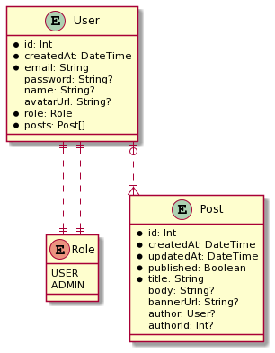

# Blogsample
Work in progress, don't take it too seriously

## Setup
Install the dependencies
```shell
yarn
```
Create a .env file on the root folder with a content like this
```
DB_HOST="localhost"
DB_NAME="blogsample"
DB_USER="root"
DB_PASS="root"
DATABASE_URL="mysql://${DB_USER}:${DB_PASS}@${DB_HOST}:3306/${DB_NAME}?useSSL=false"

JWT_SECRET="<any secret here>"
STORYBOOK_ZEPLIN_TOKEN="<zeplin access token here, create one here: https://app.zeplin.io/profile/developer >"
```

Create the database
```shell
npx prisma db push
```

## Run
```shell
yarn dev
```

## Prisma Studio
To visualize and edit the database data
```shell
yarn studio
```

## Prisma Generate
Execute this command everytime you change the schema.prisma file:
```shell
yarn prisma
```

## Storybook
To visualize the Components and their different states and documentation
```shell
yarn storybook
```

## Recommended IntelliJ Plugins
- JS GraphQL
- Prisma Support
- MDX

## Code Guide Documentation
The starting point of the application is on [pages](pages), follow this link to understand everything.

## Technologies
This is a [Next](https://nextjs.org/) Application, which is a [React](https://reactjs.org/) web application with
Server-side Rendering capabilities.

For the Back-end API we are using [GraphQL protocol](https://graphql.org/) implemented with
[Apollo Server](https://www.apollographql.com/) and [TypeGraphQL](https://typegraphql.com/).

For the Database we are using [Prisma](https://www.prisma.io/) with [MySQL](https://www.mysql.com/).

For the Front-end styling we are using [ChakraUI](https://chakra-ui.com/).

## Database Class Diagram

